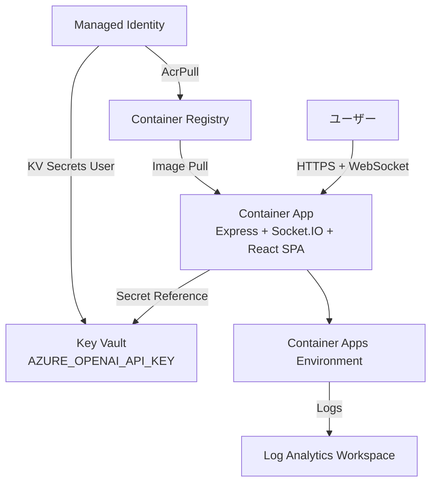

# 🎯 Self-Intro Quiz（自己紹介クイズ）

参加者が入力した自己紹介情報をもとに、AIが自動生成するクイズで盛り上がる Web アプリケーション。

## 機能

- ルームを作成して参加者を招待（Room Code 共有）
- 参加者がプロフィール（趣味・特技・出身地 等）を入力
- AI（Azure OpenAI GPT-5.1）が4択クイズを自動生成
- リアルタイムでクイズに回答、スコアボードで競争
- 途中参加OK（次の問題から即参加可能）

## 想定シーン

- 社内懇親会・キックオフ
- 勉強会・カンファレンスのアイスブレイク
- オンライン飲み会
- 新入社員研修

## 技術スタック

- **Frontend**: React + Vite + Tailwind CSS
- **Backend**: Node.js + Express + Socket.IO
- **AI**: Azure OpenAI API (GPT-5.1)
- **Language**: TypeScript (全層)
- **Monorepo**: npm workspaces
- **Architecture**: DDD (Bounded Context: Room / Quiz)

## プロジェクト構成

```text
wdp-self-intro-quiz/
├── .env.example               # 環境変数テンプレート
├── package.json               # npm workspaces ルート
├── tsconfig.base.json         # 共通 TypeScript 設定
├── docs/                      # ドキュメント
│   ├── prd.md
│   ├── technical-design.md
│   ├── api-events.md
│   ├── tech-spec.md
│   └── adr/
└── packages/
    ├── shared/                # 共有型定義・定数・バリデーション
    │   └── src/
    │       ├── types/          # room.ts / quiz.ts / profile.ts / sync.ts
    │       ├── constants.ts
    │       ├── events.ts
    │       ├── validation.ts
    │       └── index.ts
    ├── server/                # Express + Socket.IO サーバ
    │   └── src/
    │       ├── index.ts           # エントリポイント（DI 組み立て）
    │       ├── domain/
    │       │   ├── room/          # RoomAggregate / RoomRepository (Port)
    │       │   └── quiz/          # QuizAggregate / QuizGenerator / QuizRepository (Port)
    │       ├── application/       # roomHandlers / quizHandlers
    │       ├── infrastructure/    # InMemory実装 / AzureOpenAIQuizGenerator / NodeTimerService
    │       └── utils/             # roomCode / sanitize / logger
    └── client/                # React SPA
        └── src/
            ├── main.tsx / App.tsx / index.css
            ├── pages/         # TopPage / CreateRoomPage / JoinRoomPage / RoomPage
            ├── components/    # ProfileForm / ParticipantList / LobbyView / QuizView / ResultView 等
            ├── stores/        # useRoomStore / useQuizStore (Zustand)
            ├── hooks/         # useSocket / useTimer
            └── lib/           # socket.ts (Socket.IO クライアント)
```

## セットアップ

```bash
# 依存関係インストール
npm install

# 環境変数設定
cp .env.example .env
# .env に Azure OpenAI の接続情報を設定（AI 使用時）

# 開発サーバ起動（スタブモード、AI 不使用）
npm run dev

# AI 使用で起動（Azure OpenAI）
npm run dev:ai

# テスト
npm test

# ビルド
npm run build
```

## E2E セットアップ（手動テスト用）

Playwright を使って、ブラウザ 3 つを自動で立ち上げ「ルーム作成→参加→プロフィール入力」まで一括で完了させるスクリプトがあります。

```bash
# 事前に dev サーバを起動
npm run dev

# 別のターミナルで実行（Chromium が 3 ウィンドウ開く）
npm run e2e:setup
```

3 人分のダミープロフィールが自動入力・送信され、完了後はブラウザが開いたまま停止します。そのまま手動でクイズ生成やプレイを試せます。

## Azure デプロイ

Azure Container Apps にデプロイできます。フロントエンド（React SPA）とバックエンド（Express + Socket.IO）を単一コンテナにまとめて配信します。

### アーキテクチャ



### 前提条件

- [Azure Developer CLI (azd)](https://aka.ms/azd/install) v1.20.0 以上
- [Docker Desktop](https://www.docker.com/products/docker-desktop/)
- Azure サブスクリプション

### デプロイ手順

```bash
# 1. Azure にログイン
azd auth login

# 2. azd 環境を初期化（初回のみ）
azd init

# 3. プロビジョニング + デプロイ（リージョン・サブスクリプション選択あり）
azd up
```

### 運用コマンド

```bash
# コード変更のみ再デプロイ
azd deploy

# インフラ変更の適用
azd provision

# 全リソースの削除
azd down
```

### プロビジョニングされるリソース

| リソース | 用途 |
|---|---|
| Azure Container App | アプリケーションホスティング（WebSocket 対応） |
| Container Registry | Docker イメージの格納 |
| Key Vault | API キーの安全な管理 |
| Log Analytics Workspace | ログ収集・監視 |
| User-Assigned Managed Identity | ACR / Key Vault への RBAC アクセス |

### 注意事項

- Socket.IO はインメモリステートを使用しているため、**レプリカ数は 1 を推奨**
- 複数レプリカでのスケールアウトには [Socket.IO Redis Adapter](https://socket.io/docs/v4/redis-adapter/) の導入が必要
- デフォルトリージョンは `japaneast`（`azd env set AZURE_LOCATION <region>` で変更可能）

## ドキュメント

- [PRD（プロダクト仕様書）](docs/prd.md)
- [技術設計書](docs/technical-design.md)
- [Socket.IO イベント仕様書](docs/api-events.md)
- [Tech Spec（技術仕様書）](docs/tech-spec.md)
- [ADR（Architecture Decision Records）](docs/adr/)
- [CHANGELOG](CHANGELOG.md)

## ライセンス

MIT
